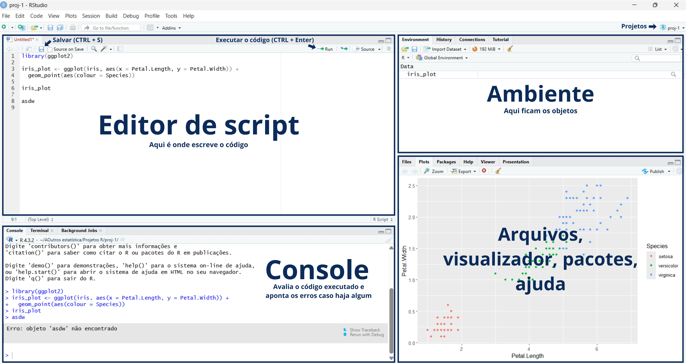
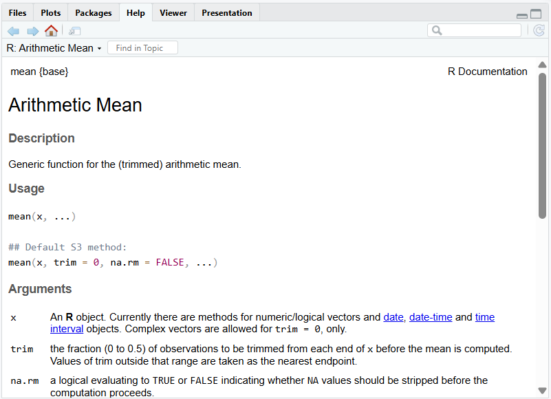
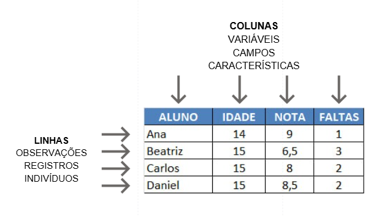

Pense em uma ferramenta que ajuda você a transformar dúvidas em respostas com base em dados, seja para entender o efeito de uma vacina em uma população, acompanhar o aumento de casos ao longo do tempo ou comparar quantas pessoas melhoraram após um tratamento. No começo pode parecer confuso, com telas, códigos e termos novos. Mas é assim que você começa a sair do “achismo” e passa a entender os problemas de saúde com mais clareza, precisão e base científica.

## 📱 Interface do RStudio



### Ajuda

Caso tenha dúvida em qualquer função, basta digitar **?** antes da função no console, conforme o exemplo abaixo com a função `mean` (utilizada para obter a média de vários números).

```{r}
#| eval: false

?mean
```

Na guia **help**, no canto inferior direito, irá aparecer as informações de como utilizar a função.



## 🧬 Estrutura do código no R

```{r}
#| eval: false

# quanto é dois mais dois? <--- comentário
2 + 2 # <--- código

#> [1] 4 <---resultado impresso no console
```

## 📁 Projetos e diretório de trabalho

### Acessar bancos de dados em diretórios diferentes

Observe a seguinte estrutura de arquivos:

```         
/
├── Downloads/
│   ├── dados_1.csv
│   └── Pasta/
│       └── dados_2.csv
│
└── Documentos/
    └── dados_3.csv
```

Para executar os 3 bancos de dados, é preciso fazer:

```{r}
#| eval: false

dados_1 <- read.csv('Downloads/dados_1.csv')
dados_2 <- read.csv('Downloads/Pasta/dados_2.csv')
dados_3 <- read.csv('Documentos/dados_3.csv')
```

### Acessar bancos de dados em um diretório de trabalho

Mas se estiverem organizados todos no mesmo arquivo, como abaixo:

```         
/
├── Downloads/
│   └── Pasta/
│       └── dados_1.csv
        └── dados_2.csv
        └── dados_3.csv
```

Pode-se usar a função `setwd()` para definir o diretório de trabalho, e `getwd()` para verificar qual é o diretório atual.

```{r}
#| eval: false

setwd('Downloads/Pasta')

dados_1 <- read.csv('dados_1.csv')
dados_2 <- read.csv('dados_2.csv')
dados_3 <- read.csv('dados_3.csv')

getwd()

#> [1] "C:/Users/Computador/Downloads/Pasta"
```

### Criar um projeto

Uma forma simples e prática de organizar seu trabalho no R é usando projetos. Com eles, você mantém tudo do mesmo trabalho em um só lugar: dados, códigos e outros arquivos.

Além disso, o projeto “lembra” como você deixou seu trabalho. Quando você abre o projeto, no canto superior direito do RStudio, (veja a figura da Interface do RStudio), os scripts que estavam abertos na última vez aparecem de novo automaticamente. Assim, você pode continuar exatamente de onde parou, sem precisar procurar tudo de novo.

```         
/
├── Downloads/
│   └── Projeto/
│       ├── projeto.Rproj
│       ├── script-1.R
│       ├── script-2.R
│       ├── README.md
│       ├── .gitignore
│       └── Dados/
│           ├── dados_1.csv
│           ├── dados_2.csv
│           └── dados_3.csv
```

```{r}
#| eval: false

dados_1 <- read.csv('Dados/dados_1.csv')
dados_2 <- read.csv('Dados/dados_2.csv')
dados_3 <- read.csv('Dados/dados_3.csv')
```

## 🏦 Estrutura de um banco de dados

Um banco de dados estruturado geralmente é organizado no formato de uma tabela. Nesse formato, existem diferentes formas de nomear suas linhas e colunas, dependendo do contexto:

```         
Linhas → Colunas
Observações → Variáveis
Registros → Campos
Indivíduos → Características
```

Apesar dos nomes variarem em diferentes contextos, a ideia é sempre a mesma: as **linhas** representam os elementos observados, enquanto as **colunas** representam as informações sobre esses elementos.

 

Nesse curso, utilizaremos a notação de **Variáveis** e **Observações**.

## 📦 Pacotes

Os pacotes são novas funções prontas feitas para resolver problemas específicos. No exemplo abaixo, foi instalado o pacote `readxl`, utilizada principalmente para importar arquivos **.xlsx**. A instalação é feita somente uma vez. Enquanto a execução precisa ser feita antes de executar as funções do pacote.

```{r}
#| eval: false

# instalar o pacote
install.packages("readxl")

# executar o pacote
library(readxl)
```

## 🔥 [Hora de praticar](ex1.html)
