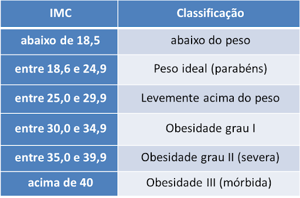

### Questão 1

Davi tem  19 anos, 1,68m de altura e pesa 72kg. Com base nestas informações, resolva os exercícios abaixo:

**a)** Com as informações de Davi, crie 4 variáveis: **nome**, **idade**, **altura** e **peso**. Em seguida, use `class()` para confirmar a classe de cada uma.

**b)** Calcule o IMC dele usando o R. A fórmula do IMC é: peso dividido pela altura ao quadrado.

> **Sugestão:** Use o operador `^` para elevar ao quadrado e `/` para dividir.

**c)** Com base na tabela abaixo, utilize operadores lógicos para verificar em qual classificação o IMC de Davi se enquadra.

> **Sugestão:** A verificação deve usar um operador lógico e o resultado será `TRUE` ou `FALSE`.



### Questão 2

O vetor abaixo representa os batimentos cardíacos (bpm) medidos de 8 idosos:

```{r}
bpm <- c(72, 85, 91, 68, 77, 104, 83, 95)
```

**a)** Selecione o terceiro valor do vetor.

**b)** Selecione os valores do segundo ao quinto elemento. 

**c)** Selecione apenas os valores acima de 90 bpm.  

**d)** Quantos pacientes têm bpm acima de 90? Use `sum()`.

### Questão 3

Crie os vetores abaixo usando a forma mais curta possível:

**a)** Números de 1 a 10.

**b)** Números de 0 a 100, de 10 em 10.

**c)** O número 5 repetido 8 vezes.