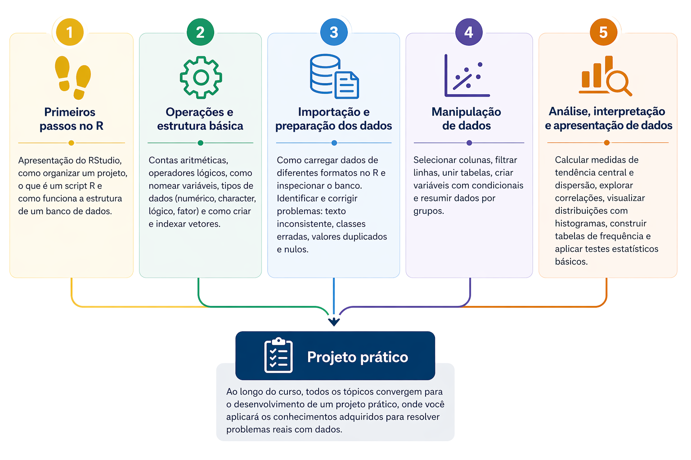

R é uma linguagem e ambiente computacional voltado à análise estatística de dados. Trata-se de um software livre, desenvolvido a partir da linguagem S, que oferece ferramentas robustas para manipulação, visualização e modelagem de dados.

## 🎯 Objetivos do curso

Este curso é uma iniciativa de extensão do Grupo de Pesquisa e Ensino em Nutrição e Saúde Coletiva (GPENSC) da Universidade Federal de Ouro Preto, voltada para profissionais e estudantes da área da saúde que desejam dar os primeiros passos na análise de dados com o software R. A proposta parte de situações práticas do contexto epidemiológico, permitindo que o participante desenvolva habilidades reais de organização, manipulação e interpretação de dados em saúde.

**Ao final do curso, você será capaz de:**

- Organizar projetos no RStudio com scripts claros e reutilizáveis.
- Importar e estruturar bancos de dados de diferentes formatos.
- Identificar e corrigir inconsistências e valores ausentes.
- Manipular dados: filtrar, transformar e combinar tabelas.
- Automatizar análises repetitivas com scripts.
- Calcular e interpretar medidas e testes estatísticos básicos.
- Criar gráficos para explorar e comunicar resultados.

## 📚 Estrutura do Curso 

O conteúdo está organizado em módulos progressivos, combinando teoria e prática com exemplos reais, e está dividido nos seguintes tópicos:



## ▶️ Demonstrações

As demonstrações utilizam dados simulados, inspirados em situações epidemiológicas reais, com o objetivo de facilitar o entendimento dos conceitos apresentados.

### Distribuição de pressão arterial

Simula medições de pressão arterial de vários pacientes e mostra como esses valores se distribuem. Útil para identificar o que é comum e o que foge do padrão.

```{r}
pressao <- rnorm(1000, mean = 120, sd = 15)
hist(pressao, col = "lightblue", main = "Distribuição da pressão arterial")
```

### Verificação de diferença significativa em níveis de glicemia

Compara níveis de glicemia entre dois grupos (por exemplo, com e sem intervenção) e verifica se a diferença observada pode ser considerada real.

```{r}
dados <- data.frame(
  grupo = rep(c("Controle", "Tratamento"), each = 50),
  glicemia = rnorm(100, mean = rep(c(100, 90), each = 50))
)

t.test(glicemia ~ grupo, data = dados)
```

### Simulação de amostragem

Simula 5 coletas diferentes de pacientes e calcula a média de cada uma, mostrando como os resultados podem variar entre amostras, mesmo em condições semelhantes.

```{r}
medias <- numeric(5)

for(i in 1:5){
  medias[i] <- mean(rnorm(100, mean = 100))
}

medias
```

### Série temporal de um acompanhamento epidemiológico

Representa a evolução de casos ao longo do tempo, ajudando a visualizar tendências de crescimento em um acompanhamento epidemiológico.

```{r}
dias <- 1:10
casos <- dias^2
plot(dias, casos, type = "b")
```


## 🙏 Agradecimentos

Agradeço à Profa. **Raquel de Deus Mendonça** pelo convite, à Profa. **Ariene Silva do Carmo** pela idealização do projeto, ao Prof. **Tiago Martins Pereira** pela autorização para uso dos códigos na elaboração do material e ao Prof. **Fernando Luiz Pereira de Oliveira** pela revisão. A participação de todos foi fundamental para a realização deste curso.


## 📖 Referências

BATTISTI, Iara Denise Endruweit; SMOLSKI, Felipe Micail da Silva (orgs.). **Software R: Análise estatística de dados utilizando um programa livre**. Bagé: Faith, 2019. Disponível em: http:// www.editorafaith.com.br/ebooks/grat/978-85-68221-44-0.pdf.

COSTA, Maria Fernanda F. Lima et al. **The Bambuí health and ageing study (BHAS): methodological approach and preliminary results of a population-based cohort study of the elderly in Brazil.** Revista de Saúde Pública, v. 34, p. 126-135, 2000.

LIMA E COSTA, Maria Fernanda F. de et al. **Projeto Bambuí: um estudo epidemiológico de características sociodemográficas, suporte social e indicadores de condição de saúde dos idosos em comparação aos adultos jovens**. Informe epidemiológico do SUS, v. 10, n. 4, p. 147-161, 2001.

WICKHAM, Hadley; ÇETINKAYA-RUNDEL, Mine; GROLEMUND, Garrett. **R for Data Science**. 2. ed. Disponível em: https://r4ds.hadley.nz/.

